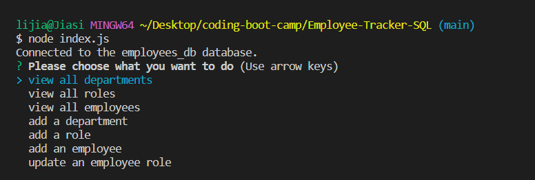
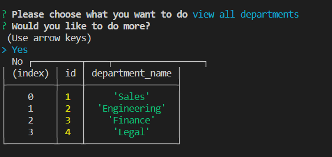
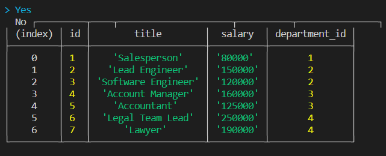
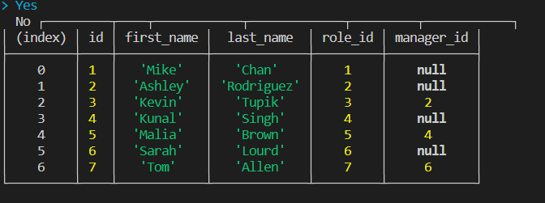

# 12 SQL: Employee Tracker

## Description
 This application is a interfaces that allow non-developers to easily view and interact with information stored in databases. Users can check the departmenta, roles, and employees in the database, and also they can add more or update departments, roles, and employees into the database. 

 ## Screenshot
 
 
 
 

## links
Link of repo: https://github.com/Jiasisi/Employee-Tracker-SQL
Link of Vedio: 